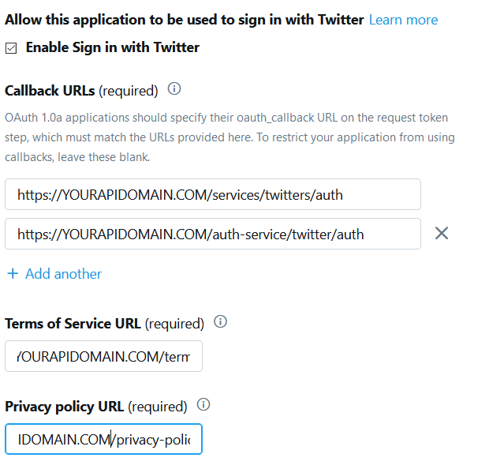

# Twitter setup tutorial

## Create a twitter application

**For this step you must have a twitter developper account**

Go to [Twitter apps page](https://developer.twitter.com/en/apps) then create an app by clicking this button

You must check `Enable Sign in with Twitter`

Then in redirect url's add:
* `https://YOURAPIDOMAIN.COM/services/twitters/auth` (Only if you want to use twitter area service)
* `https://YOURAPIDOMAIN.COM/auth-service/twitters/auth` (Only if you want to use twitter auth service)

You must also set a `Terms of Service URL` and a `Privacy policy URL`

Then you must go in your app details and select the `Keys and tokens` tab

Then you must go in `Permissions` tab and select `Read, write, and Direct Messages` in `Access permission` and check `Request email address from users` in `Additional permissions`

After that in `Access token & access token secret` click on `generate` button.
Keep a copy of the `Access token` and `Access token secret`.

**Now we gonna create subscriptions environments (This step is only for twitter area service)**

Now open the menu entitled with your twitter username and then select `Dev environments`

You must create an `Account Activity API` with as parameters

`develop` for the the name of the environment

And your app as linked application

**Setup environment variables**

Right now you have to setup environment variables for twitter.

All the value for the variables can be found in `Apps > *Your App* > Keys and tokens` (All of these variable must be setup in your `.env` file)

* `TWITTER_CONSUMER_KEY`: API key
* `TWITTER_CONSUMER_SECRET`: API secret key
* `TWITTER_TOKEN`: Access token
* `TWITTER_CONSUMER_SECRET`: Access token secret

